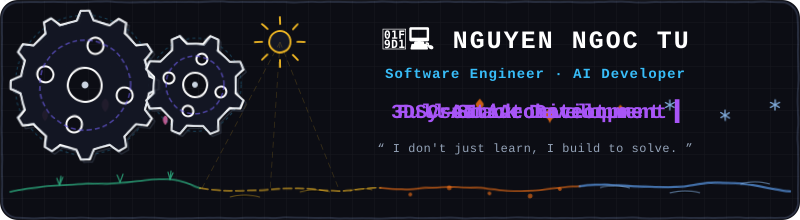

<!-- ================= SKETCHY EXCALIDRAW ANIMATED ALL-IN-ONE HEADER BANNER ================= -->

---

## ⚡ Automation Core Focus

> **"If it has to be done twice, it should be automated."**
> 
> Software Engineer with an obsessive focus on **AI Automation**, **Autonomous Workflows**, and **System Architecture**. From web scraping anti-bot bypasses to LLM agent orchestration, I build systems that run seamlessly without human intervention.

---

## ⚙️ Areas of Interest & Expertise

- 🤖 **Autonomous AI Agents & RAG**: Building multi-agent workflows, tool-calling loops, and high-accuracy vector retrieval pipelines (OpenAI / Gemini / n8n / MCP).
- 🕷️ **Advanced Web Extraction & Anti-Bot Bypassing**: Session cookie auto-rotation, residential proxy orchestration, and headless browser automation (Playwright / Camoufox / DCOM).
- 🔄 **Real-Time Data Pipelines & Microservices**: Event-driven architectures, queue processing, and high-throughput real-time streaming (FastAPI / Redis Pub-Sub / WebRTC / Docker).
- 🎬 **Programmatic Media & Content Pipelines**: Autonomous video/image generation, browser-based rendering, and automated multi-channel publishing (Remotion / MoviePy / FFmpeg).

---

## 🛠️ Automation Tech Stack

| Domain | Focus & Tools |
| :--- | :--- |
| **Languages & Core** | `Python` `TypeScript` `JavaScript` `Node.js` `Asyncio` `SQL` |
| **AI & Automation** | `LLM Orchestration` `Autonomous RAG` `n8n` `Playwright` `Camoufox` `Vector DBs` |
| **Backend & Messaging** | `FastAPI` `Express` `Redis Pub/Sub` `Socket.IO` `Mediasoup` `PostgreSQL` |
| **DevOps & Proxies** | `Docker` `Anti-bot Bypass` `DCOM/Proxy Box Rotation` `Linux` `PM2` `Supabase` |

---

## 📫 Connect With Me

  
  
  
  

*AUTOMATE EVERYTHING · "I don't just learn, I build to solve."*

